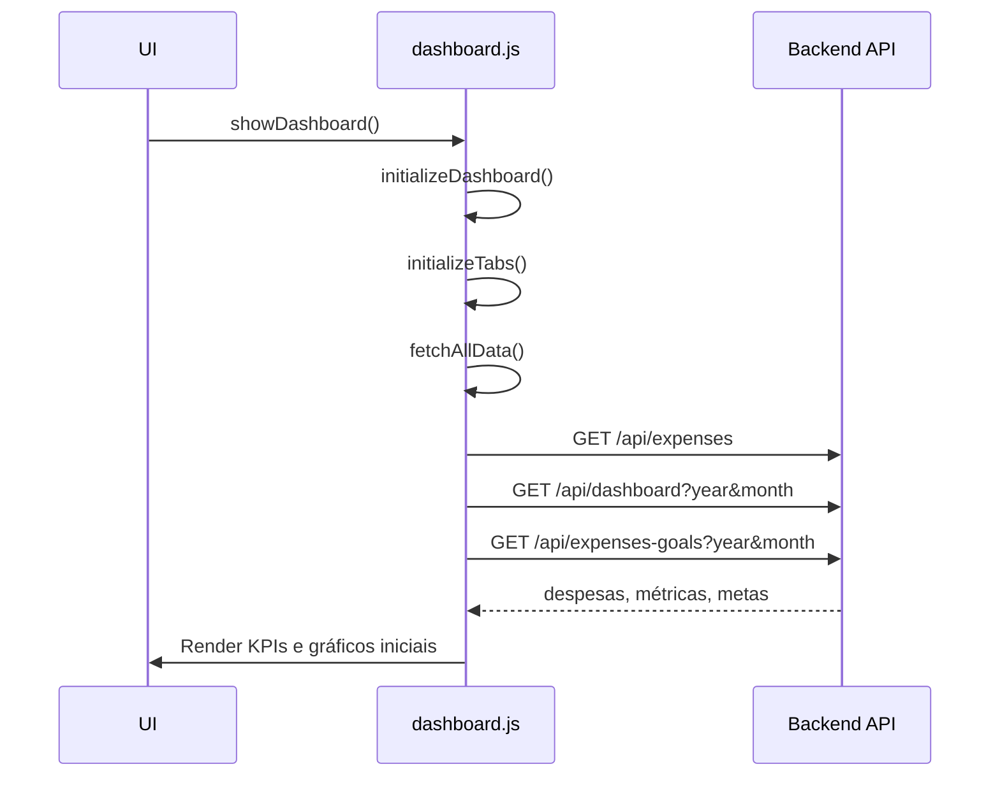
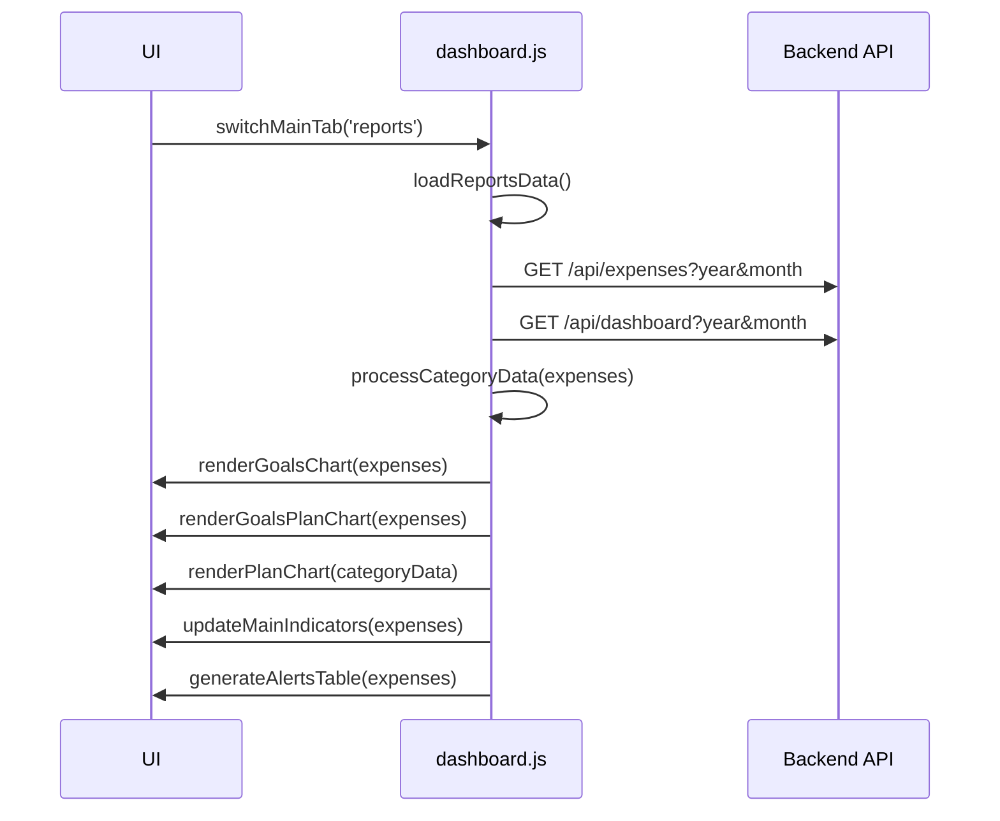
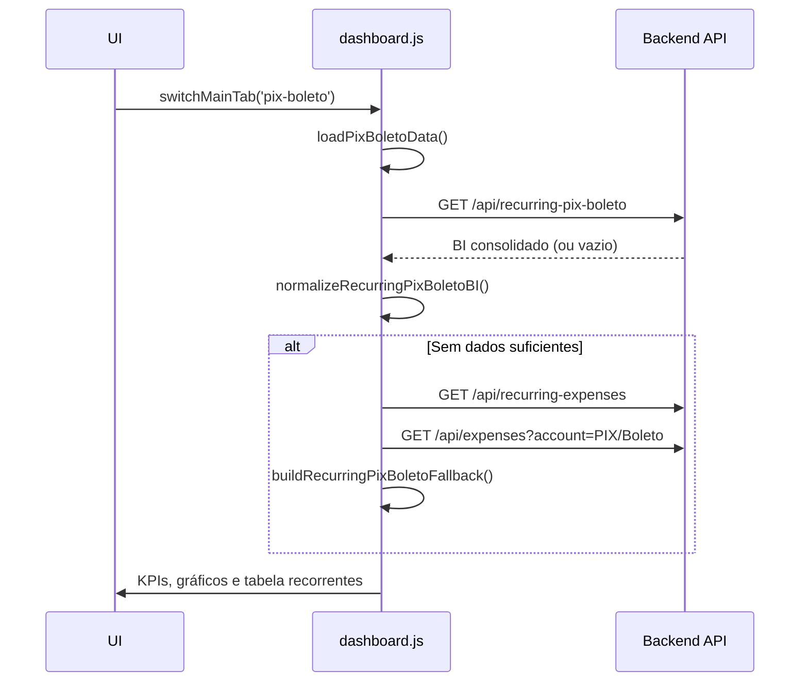
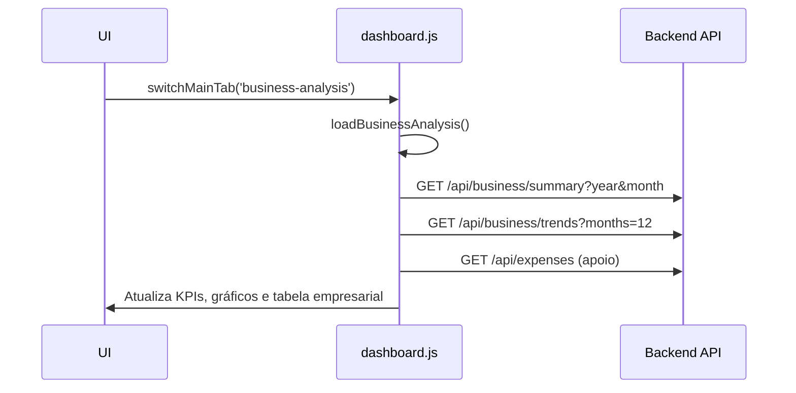

# Fluxos de Abas e Carregamentos

Este documento descreve, de forma visual, como a navegação por abas funciona no Dashboard e quais carregamentos específicos ocorrem em cada aba.

## Visão Geral da Navegação de Abas

```mermaid
flowchart LR
    A[.tab-button click] --> B{switchMainTab(tabName)}
    B --> C[Ativa botão: adiciona classe active]
    B --> D[Esconde todas .tab-content]
    B --> E[Mostra #${tabName}-tab]
    B --> F{Carregamento específico?}
    F -->|tabName === 'business-analysis'| G[loadBusinessAnalysis()]
    F -->|tabName === 'reports'| H[loadReportsData()]
    F -->|tabName === 'pix-boleto'| I[loadPixBoletoData()]
    F -->|outros| J[Log: aba ativada]
```

- A função `initializeTabs()` associa os cliques aos botões de aba e chama `switchMainTab()` para centralizar a troca.
- A aba inicial é ativada chamando `switchMainTab()` uma vez (evitando duplicidade de lógicas).

## Fluxo: Inicialização do Dashboard



## Fluxo: Aba Relatórios



## Fluxo: Aba PIX & Boleto (BI Recorrentes)



## Fluxo: Aba Análise Empresarial



## Notas de Implementação

- A lógica de troca de abas foi centralizada em `switchMainTab()`. A `initializeTabs()` apenas registra handlers de clique e chama `switchMainTab()` para ativar a aba inicial.
- Foi adicionado um guard (`data-tab-init="1"`) para evitar múltiplos event listeners no caso de re-inicializações.
- Carregamentos específicos por aba são tratados condicionalmente dentro de `switchMainTab()`.
